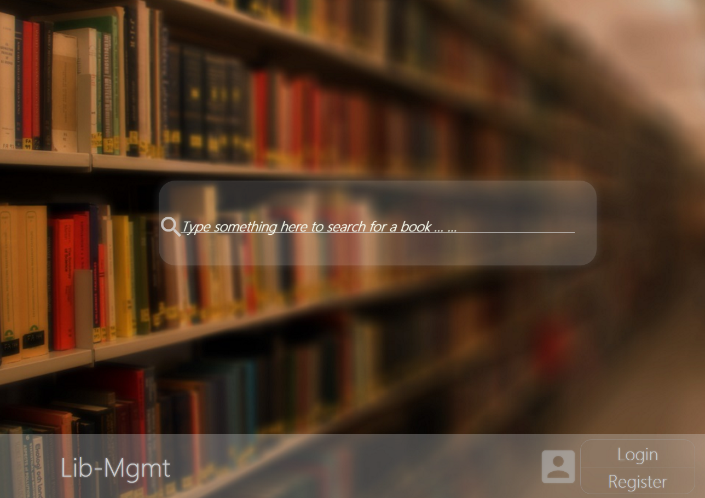
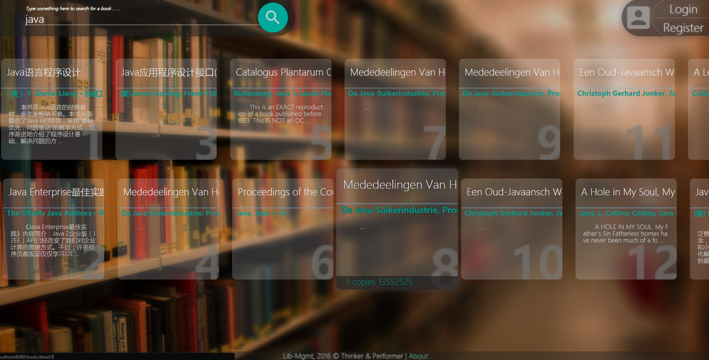

[Lib Mgmt] 

Library Management System in Java
=================================
> By Thinker & Performer

This repo contains the source code and documents related to
project `Lib Mgmt`.

Intro
=====
Lib-mgmt (short for *Library Management*) is a Java Web application wich provide a simple solution for small scale library to manage thier books and loan transactions. 

Basically, it this project consists three components, the user and role management system, book management system and loan management. The user and role management system provide a layered role based user management interface. Users in this system will be divided into 4 types, the admin, librarians, students and guests. The book management system provides a interface to input new book entry, manage its copies, comment the book (also rate the comment), update and search the content. The third part, loan managemnt system is tightly integrated into the book management system, provide interface for librarian to lend book to student and accept book from student in different scenarios including book lost, broken, due and extending loan period. 

Some popular frameworks and libraries are used in this project including Spring Framework MVC and Hibernate.

How to run
==========
 In order yo compile and run this project locally, genrally 
speaking, you need following steps:
 
 1. Clone this project
 2. Update database connection configuration
 3. compile Java, Less code 
 4. package libs, class files, static contents and configs
 5. deploy to application container

Prerequisite
============
 * JDK 1.8 + 
 * MySQL 5.x
 * Tomcat 8.0 + / Jetty 8 +

Team Member
===========
 * Jack Q (乔波, 软件44, 2141601066)
 * AbrahamX (寻医农, 软件44, 2141601070)
 * HanU-U (武晗, 软件44, 2141601058)

Screenshots
===========
 * Index Page
  

 * Search result page
  
